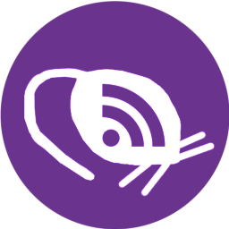

<div align="center">
    
</div>

# PodRat

1. [About](#about)
    - [Built With](#built-with)
2. [Features](#features)
3. [Installation](#installation)
   1. [Windows](#windows)
        - [Installing](#installing)
        - [Uninstalling](#uninstalling)
        - [Updating](#updating)
   2. [Ubuntu/Debian](#ubuntudebian)
        - [Installing](#installing-1)
        - [Uninstalling](#uninstalling-1)
        - [Updating](#updating-1)
4. [Planned Features](#planned-features)
5. [License](#license)
6. [Acknowledgments](#acknowledgments)

## About
**PodRat** is a simple desktop application for listening to RSS-based podcasts.

Input a RSS feed link, download your favorite episodes, and listen!

### Built With
- [.NET 10.0](https://dotnet.microsoft.com/en-us/)
- [C#](https://dotnet.microsoft.com/en-us/languages/csharp)
- [Avalonia UI](https://avaloniaui.net/)
- [LibVLCSharp](https://github.com/videolan/libvlcsharp)


## Features
- View multiple podcast RSS feeds
- Download, play, and delete episodes
- Saves and automatically resumes where you left off on each episode
- View episode metadata (thumbnail, description, post date, length, file size)
- Dark/Light themes

## Installation
The latest version can be found in the 
[Releases](https://github.com/Jess-Klost/PodRat/releases)
tab. View the following sections for specific steps for installing on specific 
operating systems: 

### Windows
#### Installing
1. Download the latest Windows installer from the [Releases](https://github.com/Jess-Klost/PodRat/releases) tab (Example: ``podrat-winx64-x.x.x-setup.exe``). 
2. Run the installer by double-clicking the executable file.
3. Follow the installation wizard instructions.
4. Start PodRat from the start menu or desktop shortcut
> **_NOTE:_** PodRat may take a while to open the first time it is started.

#### Uninstalling
> **_NOTE:_** Uninstalling PodRat will not remove any downloaded episodes or 
saved settings. To remove all data, remove the 
``C:\Users\{User}\AppData\Roaming\PodRat`` directory.

To uninstall PodRat, either:
- Right click PodRat in the start menu and select **Uninstall**  
- Open **Settings** > Apps > Installed Apps, find PodRat and select **Uninstall**

#### Updating
To update PodRat, uninstall the current version by following the
steps in [Uninstalling](#uninstalling), then install the latest version by
following the steps in [Installing](#installing).

### Ubuntu/Debian
> **_NOTE:_**  Only **Ubuntu 24.04** has been tested. PodRat depends on the ``vlc`` and ``libvlc-dev`` packages, so ensure that these exist on your distribution.

#### Installing
1. Download the latest release from the [Releases](https://github.com/Jess-Klost/PodRat/releases) tab (Example: 
podrat-x64-x.x.x.deb).
2. Open a terminal in the directory that contains the file you downloaded.
3. Run the following command with the name of the file:
```bash
sudo apt install ./podrat-x64-x.x.x.deb
```

#### Uninstalling
> **_NOTE:_** Uninstalling PodRat will not remove any downloaded episodes or 
saved settings. To remove all data, remove the ``~/.podrat`` directory.

Run the following command in a terminal:
```bash
sudo apt remove podrat
```

#### Updating
To update, simply follow the steps in [Installing](#installing-1) with the 
latest version's .deb file.

## Planned Features
> **_NOTE:_** None of the following features are guaranteed, these are simply
features I would like to implement if I have the time.
- Episode search function
- Podcast feeds search function
- Podcast feeds list view
- Flatpak deployment  

## License
Distributed under the **GNU General Public License v3.0**. See 
[LICENSE.md](./LICENSE.md) for more information.

## Acknowledgments
- [Avalonia UI](https://github.com/AvaloniaUI/Avalonia) 
- [LibVLCSharp](https://github.com/videolan/libvlcsharp)
- [AsyncImageLoader.Avalonia](https://github.com/AvaloniaUtils/AsyncImageLoader.Avalonia)
- [CommunityToolkit.Mvvm](https://github.com/MicrosoftDocs/CommunityToolkit/)
